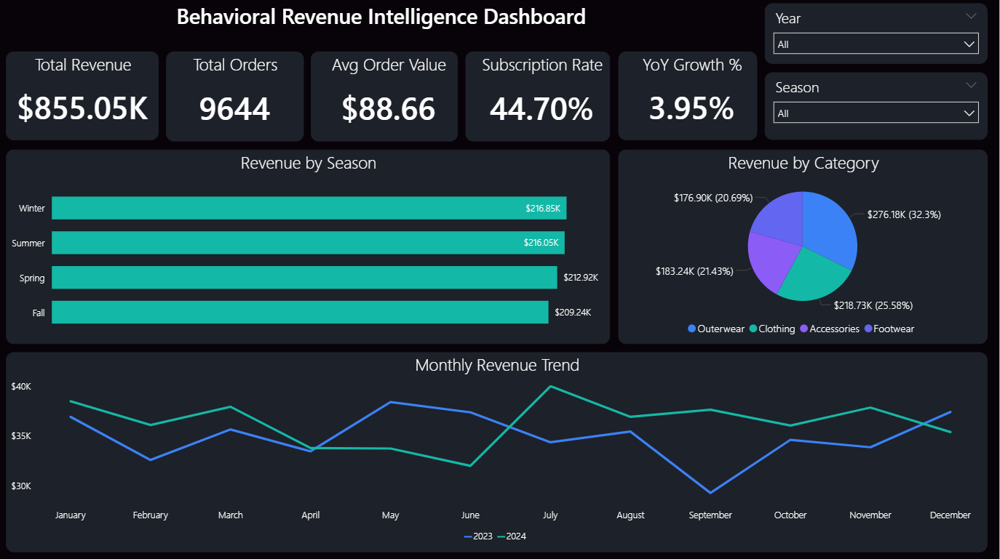
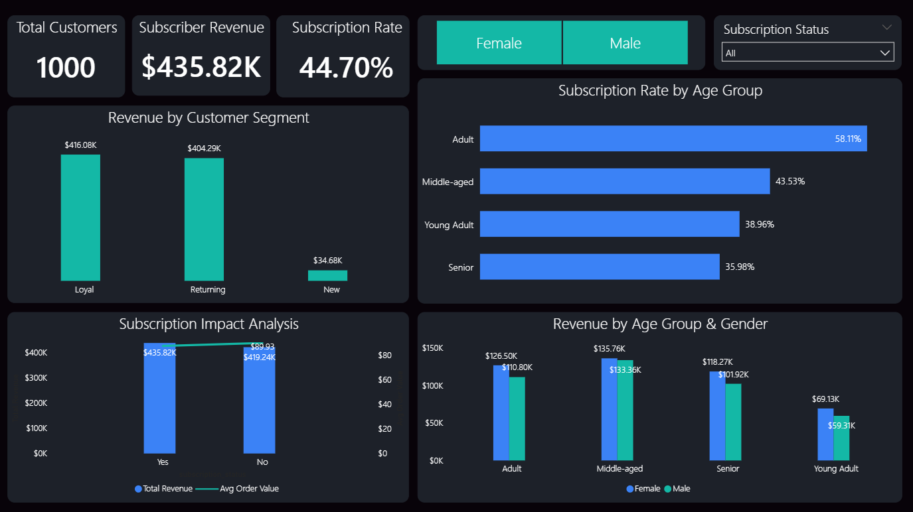
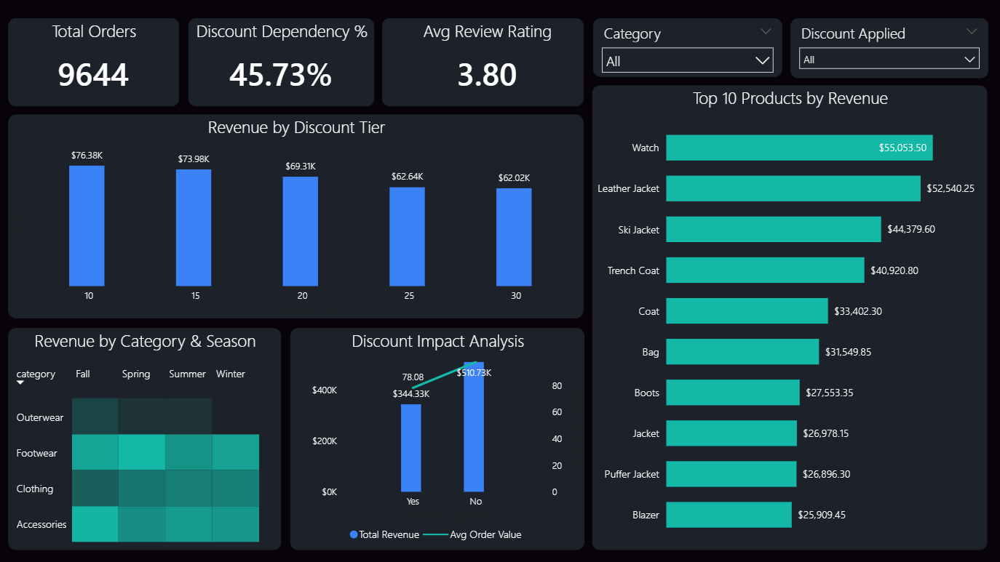

# Behavioral Revenue Intelligence & Customer Strategy Analysis


## 📌 Project Overview

An end-to-end Business Intelligence project analyzing customer purchasing 
behavior, subscription impact, discount dependency, and product performance 
across a retail business with 1,000 customers and 9,644 transactions 
spanning January 2023 – December 2024.

Built on a **Star Schema data model** across three stages:
Python (EDA) → MySQL (Business Analysis) → Power BI (Dashboard)

---

## 🎯 Business Objectives

- Identify which customer segments drive the most revenue
- Measure the effectiveness of the subscription program
- Analyze discount dependency and its impact on margins
- Understand seasonal and demographic revenue patterns
- Surface top-performing products for inventory decisions

---

## 🗂️ Project Structure
```
behavioral-revenue-intelligence/
│
├── 📁 data/
│   ├── Dim_Customer.csv        # 1,000 customers with demographics
│   ├── Dim_Product.csv         # 45 products across 4 categories
│   └── Fact_Transactions.csv   # 9,644 purchase transactions
│
├── 📁 sql/
│   └── Behavioral_Revenue_Intelligence.sql   # 15 business queries
│
├── 📁 python/
│   └── Behavioral_Revenue_Intelligence_EDA.ipynb  # EDA notebook
│
├── 📁 dashboard/
│   ├── page1_executive_summary.png
│   ├── page2_customer_intelligence.png
│   ├── page3_product_discount.png
│   └── Behavioral_Revenue_Intelligence.pbix
│
└── README.md
```

---

## 🛠️ Tools & Technologies

| Tool | Purpose |
|---|---|
| Python (pandas, matplotlib, seaborn) | Data preparation, EDA, visualizations |
| MySQL Workbench | Star schema design, business queries |
| Power BI Desktop | Data modeling, DAX measures, dashboard |
| Google Colab | Python notebook environment |
| GitHub | Version control and project hosting |

---

## 🏗️ Data Architecture — Star Schema
```
Dim_Customer (1,000 rows)          Dim_Product (45 rows)
PK: customer_id                    PK: product_id
        |                                  |
        | *                             *  |
        └──────── Fact_Transactions ───────┘
                    (9,644 rows)
                  FK: customer_id
                  FK: product_id
```

---

## 🐍 Stage 1 — Python EDA

**Notebook:** `python/Behavioral_Revenue_Intelligence_EDA.ipynb`

### What Was Done
- Loaded and profiled all 3 tables
- Merged tables replicating SQL star schema JOIN logic
- Validated data quality — zero nulls, zero duplicates confirmed
- Feature engineering:
  - `customer_segment` — New / Returning / Loyal (based on order count)
  - `revenue_band` — Low / Mid / High / Premium (based on spend)
  - Date parts — year, month, month name for time-series analysis

### EDA Charts (7 total)
1. Monthly Revenue Trend — 2023 vs 2024
2. Revenue by Customer Segment
3. Subscription Program Impact (3-panel)
4. Discount & Pricing Intelligence
5. Revenue Heatmap — Category × Season
6. Revenue by Age Group & Gender
7. Top 10 Products by Revenue

---

## 🗄️ Stage 2 — MySQL

**File:** `sql/Behavioral_Revenue_Intelligence.sql`

### Schema Design
Created 3 normalized tables with foreign key relationships:
- `Dim_Customer` — customer attributes
- `Dim_Product` — product catalog
- `Fact_Transactions` — purchase events

### Business Queries (15 total across 5 categories)

| Category | Queries |
|---|---|
| Revenue Analysis | KPI summary, monthly trend, by category, by season |
| Customer Segmentation | Lifecycle CTE, age & gender, top 10 VIP customers |
| Subscription & Retention | Subscriber behavior, subscription rate by age group |
| Discount Intelligence | Discount impact, dependency by category, revenue leakage CTE |
| Product Performance | Top 10 products, top 3 per category (DENSE_RANK), shipping analysis |

### Advanced SQL Concepts Used
- CTEs (Common Table Expressions)
- Window Functions — `DENSE_RANK() OVER (PARTITION BY)`
- Subqueries
- Multi-table JOINs
- CASE WHEN segmentation
- Aggregate functions with GROUP BY / HAVING

---

## 📊 Stage 3 — Power BI Dashboard

**File:** `dashboard/Behavioral_Revenue_Intelligence.pbix`

### Data Model
Star schema with 3 tables connected via foreign keys in Power BI.

### DAX Measures (15 total)
- Core KPIs: Total Revenue, Total Orders, Avg Order Value
- Subscription Rate %, Subscriber Revenue
- Discount Dependency %, YoY Growth %
- Revenue 2023, Revenue 2024

### Dashboard Pages

**Page 1 — Executive Summary**



**Page 2 — Customer Intelligence**



**Page 3 — Product & Discount Analysis**



---

## 📈 Key Business Insights

### Revenue
- Total revenue **$855.05K** across **9,644** transactions
- YoY growth of **3.95%** from 2023 to 2024
- Revenue consistent across all seasons — Winter leads at **$216.85K**
- Outerwear dominates category revenue at **32.3% ($276.18K)**

### Customer Segments
- **Loyal customers generate 12x more revenue** than New customers
  ($416.08K vs $34.68K)
- Returning customers close behind at **$404.29K**
- Adults have highest subscription rate at **58.11%**
- Middle-aged females are the highest revenue demographic at **$135.76K**

### Subscriptions
- Subscribers generate more revenue — **$435.82K vs $419.24K**
- Subscribers have higher avg order value — **$89.93 vs $86.xx**
- Subscription rate: **44.70%** across 1,000 customers

### Discounts
- **45.73% discount dependency** — nearly half of all orders use discounts
- Non-discounted orders generate **48% more revenue** than discounted
  ($510.73K vs $344.33K)
- Revenue decreases as discount depth increases:
  10% tier ($76.38K) → 30% tier ($62.02K)
- **Recommendation:** Reduce deep discount reliance —
  margin-negative without revenue benefit

### Products
- **Watch ($55,053)** and **Leather Jacket ($52,540)** are top revenue drivers
- Top 5: Watch, Leather Jacket, Ski Jacket, Trench Coat, Coat
- All top 5 products are from Outerwear/Accessories — premium categories
- Avg review rating: **3.80 / 5.0**

---

## 🚀 How To Run This Project

**Python Notebook:**
1. Download all files from the `data/` folder
2. Place CSV files in the same directory as the notebook
3. Open `Behavioral_Revenue_Intelligence_EDA.ipynb` in Jupyter or Colab
4. Run all cells in order

**SQL:**
1. Open MySQL Workbench
2. Run `Behavioral_Revenue_Intelligence.sql`
3. CSV files will need to be imported via Table Data Import Wizard

**Power BI:**
1. Open `Behavioral_Revenue_Intelligence.pbix` in Power BI Desktop
2. Update data source paths to your local CSV files if needed

---

## 👩‍💻 Author

**Shivani Gangrade**
BI Developer | Data Analyst
📧 shivanigangrade10@gmail.com
🔗 [LinkedIn](https://linkedin.com/in/shivani-gangrade10)
